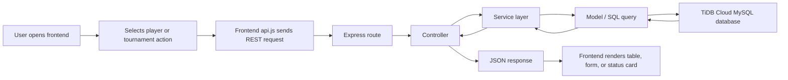
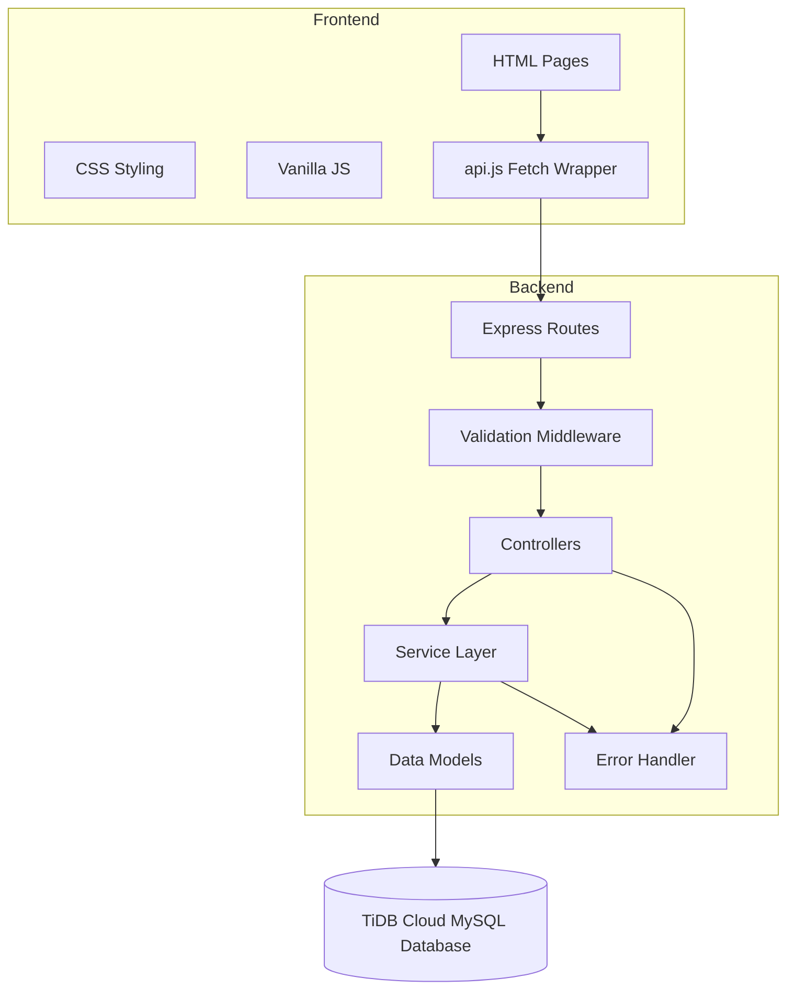
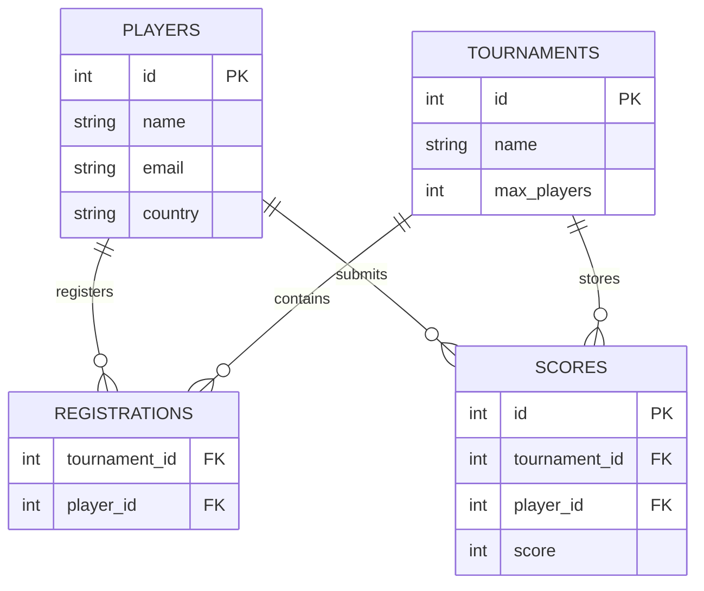

# 🏆 Tournament Registration & Leaderboard System


## 1. Project Title

**Tournament Registration & Leaderboard System**

## 2. Project Description

This project is a full-stack tournament management application built for a Node.js internship assignment. It allows users to manage players and tournaments, register players into tournaments, submit scores, and view live leaderboards and individual player ranks.

The application is intentionally designed with production-quality structure and maintainability in mind. The frontend is built with HTML, CSS, and Vanilla JavaScript, while the backend follows an MVC architecture with a service layer, REST APIs, validation middleware, and a MySQL-compatible TiDB Cloud database.

## 3. Project Overview

The system supports the complete tournament lifecycle:

1. Create and manage players.
2. Create and manage tournaments.
3. Register players into tournaments.
4. Load only the available players for a selected tournament.
5. Submit or update scores for registered players.
6. Display tournament leaderboards.
7. View the rank and score of a specific player in a tournament.

The backend exposes REST endpoints under `/api`, and the frontend consumes them through a centralized `api.js` abstraction.

## 4. Features

- Player management with create, view, update, and delete actions.
- Tournament management with CRUD operations.
- Tournament registration with duplicate registration prevention.
- Dynamic loading of available players for each tournament.
- Score submission with update-on-duplicate behavior.
- Tournament leaderboard sorted by score.
- Individual player rank API and UI lookup.
- Input validation at the route and service layers.
- Centralized API helper for the frontend.
- Responsive UI with modern card-based layout.
- TiDB Cloud database integration.
- Clear error responses and consistent success responses.

## 5. System Workflow



### Typical User Flow

1. Add players.
2. Create a tournament.
3. Register players into the tournament.
4. Submit or update scores.
5. Load the leaderboard.
6. Check a specific player's rank and score.

## 6. System Architecture



## 7. Folder Structure

```text
Tournament-System/
├─ backend/
│  ├─ package.json
│  └─ src/
│     ├─ app.js
│     ├─ server.js
│     ├─ config/
│     ├─ controllers/
│     ├─ exceptions/
│     ├─ middleware/
│     ├─ models/
│     ├─ prisma/
│     ├─ routes/
│     ├─ services/
│     ├─ utils/
│     └─ validators/
├─ frontend/
│  ├─ index.html
│  ├─ css/
│  │  └─ style.css
│  ├─ js/
│  │  ├─ api.js
│  │  ├─ leaderboard.js
│  │  ├─ players.js
│  │  ├─ registration.js
│  │  ├─ scores.js
│  │  └─ tournaments.js
│  └─ pages/
│     ├─ leaderboard.html
│     ├─ players.html
│     ├─ register.html
│     ├─ scores.html
│     └─ tournaments.html
└─ README.md
```

## 8. Technology Stack

| Layer | Technology | Purpose |
|---|---|---|
| Frontend | HTML | Page structure |
| Frontend | CSS | Responsive styling and UI polish |
| Frontend | Vanilla JavaScript | DOM handling and API calls |
| Backend | Node.js | Runtime |
| Backend | Express.js | HTTP server and routing |
| Backend | MVC Architecture | Separation of concerns |
| Backend | Service Layer | Business logic |
| Backend | express-validator | Input validation |
| Database | MySQL-compatible TiDB Cloud | Persistent storage |
| Database Driver | mysql2 | Query execution |
| Dev Tooling | nodemon | Development auto-reload |

## 9. Database Design

The database is organized around four core entities:

- `players` stores player identity and contact details.
- `tournaments` stores tournament metadata and capacity.
- `registrations` links players to tournaments.
- `scores` stores tournament scores per player.

### Design Goals

- Prevent duplicate player registration.
- Allow score updates instead of duplicate score rows.
- Keep queries simple and efficient for leaderboard rendering.
- Support MySQL-compatible TiDB Cloud behavior.

### Relationship Summary

- One player can register in many tournaments.
- One tournament can contain many players.
- One score record belongs to one player in one tournament.
- The leaderboard is generated from joined `scores`, `players`, and `tournaments` data.

## 10. Database Schema

The following SQL migration can be used to initialize the database structure used by the application.

```sql
CREATE DATABASE tournament_system;
USE tournament_system;

CREATE TABLE players (
	id INT AUTO_INCREMENT PRIMARY KEY,
	name VARCHAR(100) NOT NULL,
	email VARCHAR(255) NOT NULL UNIQUE,
	country VARCHAR(100) NOT NULL,
	created_at TIMESTAMP DEFAULT CURRENT_TIMESTAMP
);

CREATE TABLE tournaments (
	id INT AUTO_INCREMENT PRIMARY KEY,
	name VARCHAR(150) NOT NULL,
	max_players INT NOT NULL,
	created_at TIMESTAMP DEFAULT CURRENT_TIMESTAMP
);

CREATE TABLE registrations (
	id INT AUTO_INCREMENT PRIMARY KEY,
	tournament_id INT NOT NULL,
	player_id INT NOT NULL,
	registered_at TIMESTAMP DEFAULT CURRENT_TIMESTAMP,

	FOREIGN KEY (tournament_id) REFERENCES tournaments(id) ON DELETE CASCADE,
	FOREIGN KEY (player_id) REFERENCES players(id) ON DELETE CASCADE,

	UNIQUE (tournament_id, player_id)
);

CREATE TABLE scores (
	id INT AUTO_INCREMENT PRIMARY KEY,
	tournament_id INT NOT NULL,
	player_id INT NOT NULL,
	score DECIMAL(10,2) NOT NULL DEFAULT 0,
	updated_at TIMESTAMP DEFAULT CURRENT_TIMESTAMP ON UPDATE CURRENT_TIMESTAMP,

	FOREIGN KEY (tournament_id) REFERENCES tournaments(id) ON DELETE CASCADE,
	FOREIGN KEY (player_id) REFERENCES players(id) ON DELETE CASCADE,

	UNIQUE (tournament_id, player_id)
);
```



### Core Table Notes

| Table | Important Columns | Notes |
|---|---|---|
| `players` | `id`, `name`, `email`, `country` | Email is validated to remain unique. |
| `tournaments` | `id`, `name`, `max_players` | Capacity is enforced before registration. |
| `registrations` | `tournament_id`, `player_id` | Prevents the same player from registering twice in the same tournament. |
| `scores` | `id`, `tournament_id`, `player_id`, `score` | Score writes use an upsert pattern. |

## 11. API Endpoints

All endpoints are prefixed with `/api`.

### Players

| Method | Endpoint | Description |
|---|---|---|
| GET | `/api/players` | Fetch all players |
| POST | `/api/players` | Create a player |
| GET | `/api/players/:id` | Get player by ID |
| PUT | `/api/players/:id` | Update player |
| DELETE | `/api/players/:id` | Delete player |
| GET | `/api/players/available/:id` | Get players not yet registered in tournament |

### Tournaments

| Method | Endpoint | Description |
|---|---|---|
| GET | `/api/tournaments` | Fetch all tournaments |
| POST | `/api/tournaments` | Create tournament |
| GET | `/api/tournaments/:id` | Get tournament by ID |
| PUT | `/api/tournaments/:id` | Update tournament |
| DELETE | `/api/tournaments/:id` | Delete tournament |

### Registration

| Method | Endpoint | Description |
|---|---|---|
| POST | `/api/tournaments/:id/register` | Register a player in a tournament |
| GET | `/api/tournaments/:id/registrations` | Get registered players for a tournament |

### Scores

| Method | Endpoint | Description |
|---|---|---|
| POST | `/api/tournaments/:id/score` | Submit or update a score |

### Leaderboard

| Method | Endpoint | Description |
|---|---|---|
| GET | `/api/tournaments/:id/leaderboard` | Get leaderboard for a tournament |
| GET | `/api/tournaments/:id/player/:playerId` | Get a single player's rank and score |

### Auth

| Method | Endpoint | Description |
|---|---|---|
| POST | `/api/auth/login` | Placeholder endpoint, returns 501 |
| POST | `/api/auth/register` | Placeholder endpoint, returns 501 |

## 12. Installation Guide

### Prerequisites

- Node.js 18 or newer
- npm
- A TiDB Cloud/MySQL-compatible database instance
- VS Code or another editor for running the frontend

### Clone the Repository

```bash
git clone <your-repository-url>
cd Tournament-System
```

### Install Backend Dependencies

```bash
cd backend
npm install
```

### Frontend Dependencies

The frontend uses plain HTML, CSS, and JavaScript, so no package installation is required.

## 13. TiDB Cloud Database Setup

1. Create a TiDB Cloud cluster.
2. Create a database named `tournament_system`.
3. Whitelist your IP address in the TiDB Cloud network access settings.
4. Create a database user and password.
5. Copy the host and port details from the TiDB Cloud connection panel.
6. Set the backend environment variables described below.

### Important TiDB Notes

- TiDB Cloud is MySQL-compatible, but its constraint behavior can differ from local MySQL.
- Use application-level validation and unique indexes for critical rules.
- If SSL issues appear locally, ensure the backend SSL settings match your TiDB Cloud connection requirements.

## 14. Environment Variables

Create a `backend/.env` file with the following values:

```env
PORT=5000
DB_HOST=your-tidb-host
DB_PORT=4000
DB_USER=your-user
DB_PASSWORD=your-password
DB_NAME=tournament_system
DB_SSL=false
DB_CONNECT_TIMEOUT=60000
CORS_ORIGINS=http://localhost:3000,http://127.0.0.1:5500
```

### Variable Reference

| Variable | Description |
|---|---|
| `PORT` | Backend port |
| `DB_HOST` | TiDB Cloud host |
| `DB_PORT` | TiDB port |
| `DB_USER` | Database username |
| `DB_PASSWORD` | Database password |
| `DB_NAME` | Database name |
| `DB_SSL` | Set to `false` for non-SSL local testing if needed |
| `DB_CONNECT_TIMEOUT` | Connection timeout in milliseconds |
| `CORS_ORIGINS` | Comma-separated list of allowed frontend origins |

## 15. Running the Backend

```bash
cd backend
npm run dev
```

The backend runs on `http://localhost:5000` by default.

### Production Start

```bash
npm start
```

## 16. Running the Frontend

Open the `frontend/index.html` file in a browser, or serve the `frontend/` directory using a static file server such as Live Server in VS Code.

### Recommended Local Options

- VS Code Live Server
- `npx http-server frontend`
- Any static hosting tool that serves HTML and JS files over HTTP

## 17. Screenshots Section

Add screenshots here before publishing the repository. Recommended assets:

| Screen | Suggested File |
|---|---|
| Dashboard | `docs/screenshots/dashboard.png` |
| Players | `docs/screenshots/players.png` |
| Tournaments | `docs/screenshots/tournaments.png` |
| Registration | `docs/screenshots/registration.png` |
| Scores | `docs/screenshots/scores.png` |
| Leaderboard | `docs/screenshots/leaderboard.png` |

## 18. Testing using Postman

Postman was used to validate the REST API and endpoint behavior manually before the frontend was tested.

### Suggested Test Flow

1. Create a player: `POST /api/players`
2. Create a tournament: `POST /api/tournaments`
3. Register the player: `POST /api/tournaments/:id/register`
4. Load registered players: `GET /api/tournaments/:id/registrations`
5. Submit a score: `POST /api/tournaments/:id/score`
6. Load leaderboard: `GET /api/tournaments/:id/leaderboard`
7. Load player rank: `GET /api/tournaments/:id/player/:playerId`

### Postman Notes

- Use `Content-Type: application/json`.
- Verify success responses and error responses.
- Test duplicate registration cases.
- Test score updates for the same player and tournament.
- Confirm backend responses in Postman first, then verify the corresponding UI flow in the frontend pages.

## 19. Problems Faced During Development

| Problem | Root Cause | Solution | Final Outcome | Lesson Learned |
|---|---|---|---|---|
| TiDB CHECK constraint issue | TiDB behavior differed from local MySQL assumptions for constraint handling | Moved critical validation into services and relied on unique keys and application checks | Validation became predictable and portable | Database rules should be aligned with the target engine, not assumed from local testing |
| TiDB Cloud connection setup | The application initially stopped at startup when the DB connection failed | Added safer startup handling and verified cloud credentials, host, and port | Backend can start reliably while surfacing DB issues clearly | Startup flow should separate server boot from external dependency checks |
| MySQL SSL configuration | TiDB Cloud SSL expectations caused connection failures in local environments | Made SSL configuration configurable through `DB_SSL` and compatible connection options | Local and cloud database access became easier to manage | External DB connectivity should be environment-driven |
| Duplicate registration prevention | A player could be registered for the same tournament more than once | Checked for existing registration before insert and enforced capacity limits | Duplicate registrations are blocked cleanly | Business rules belong in the service layer, not only in the UI |
| Dynamic player loading | Registration required tournament-specific available players instead of a static list | Added `GET /api/players/available/:id` and loaded players after selecting a tournament | The registration form now shows only valid choices | API design should support the actual user interaction flow |
| Score update instead of duplicate insertion | Re-submitting a score could create duplicate rows | Used an upsert pattern with a unique tournament-player key | Scores update cleanly without duplicates | Write operations should reflect the real business meaning of the data |
| MVC architecture decisions | Early code structure risked becoming tightly coupled | Split controllers, services, models, and middleware | The backend became easier to test and maintain | Structure matters once the application starts growing |
| Service layer implementation | Controllers could have contained too much logic | Moved business rules into service classes | Controllers remain thin and readable | A service layer keeps business behavior reusable and testable |
| Validation strategy | Invalid payloads could have reached the database | Added route-level validation middleware and service-level checks | Bad input is rejected early with clear messages | Validate early, validate consistently |
| REST API design | Inconsistent route patterns would have made the frontend harder to maintain | Used resource-oriented endpoints and consistent JSON responses | Frontend integration became simpler | Predictable APIs reduce frontend complexity |
| Error handling strategy | Errors could have produced inconsistent response formats | Introduced `AppError` and centralized error handling middleware | Errors now follow a uniform response format | Unified error handling is critical for a clean API |
| Frontend API abstraction using api.js | Repeated fetch logic would have been scattered across pages | Created one `api.js` helper with `get`, `post`, `put`, and `delete` wrappers | Frontend code is cleaner and easier to update | Repetition in network calls should be centralized immediately |
| Responsive UI implementation | Fixed layouts would have broken on smaller screens | Added flexible grids, media queries, modern cards, and adaptive spacing | The interface works better on desktop and mobile | Responsive design must be planned, not patched later |

## 20. Solutions Implemented

- Added a dedicated service layer for tournament logic.
- Prevented duplicate registrations with business checks.
- Implemented score upsert behavior for repeated submissions.
- Added player availability lookup for tournament registration.
- Implemented leaderboard and player-rank endpoints.
- Centralized frontend API requests in `api.js`.
- Added modern, responsive UI styling across the frontend.
- Added validation and consistent error responses.
- Adjusted database connectivity for TiDB Cloud compatibility.

## 21. Challenges and Learning Outcomes

- Learned how to structure a small full-stack app using MVC and a service layer.
- Learned how to design APIs around the actual UI flow.
- Learned how to handle MySQL-compatible cloud database differences.
- Learned how to prevent duplicate business operations at the service layer.
- Learned how to keep frontend network logic simple and reusable.
- Learned how to build a responsive UI without a frontend framework.

## 22. Best Practices Followed

- Separation of concerns through MVC.
- Reusable service classes for business logic.
- Centralized API response formatting.
- Server-side validation in addition to frontend constraints.
- Environment-based configuration for credentials and CORS.
- MySQL-compatible query design with unique constraints and joins.
- Responsive card-based UI and readable color contrast.
- No secrets committed to the repository.

## 23. Future Improvements

- Implement real authentication and authorization.
- Add pagination and search for players and tournaments.
- Add charts for tournament statistics.
- Replace hardcoded API base URL with environment-driven frontend config.
- Add automated integration tests.
- Add Docker support for local development and deployment.
- Add exportable Postman collection and sample test data.
- Add richer empty states and toasts across all pages.

## 24. Deployment Guide

### Backend Deployment

1. Provision a Node.js hosting environment.
2. Set all backend environment variables.
3. Ensure TiDB Cloud network access allows the deployment host.
4. Set `CORS_ORIGINS` to the production frontend domain.
5. Start the backend using `npm start`.

### Frontend Deployment

1. Host the `frontend/` directory on a static hosting platform.
2. Update `frontend/js/api.js` so `BASE_URL` points to the deployed API.
3. Ensure the backend CORS configuration allows the deployed frontend origin.

### Deployment Notes

- If frontend and backend are hosted on different domains, CORS must be configured correctly.
- For production, keep secrets in environment variables only.
- If needed, place the frontend and backend behind a reverse proxy for a same-origin setup.

## 25. GitHub Repository Instructions

- Keep commits focused and descriptive.
- Do not commit `.env` files or secrets.
- Add screenshots before publishing the repository.
- Include a Postman collection if possible.
- Use feature branches for new work.
- Open pull requests with a summary of functional changes and validation steps.
- Keep README and code changes in sync when APIs or UI flow change.

## 26. Contributing

Contributions are welcome.

1. Fork the repository.
2. Create a branch for your change.
3. Make your updates.
4. Test the backend and frontend manually.
5. Submit a pull request with a clear description.

### Suggested PR Checklist

- Code compiles and runs.
- API endpoints respond as expected.
- UI renders correctly on mobile and desktop.
- No secrets are committed.
- README is updated if behavior changes.

## 27. License

This project is licensed under the **ISC License**.

## 28. Author Information

**Author:** Rithvik

**Project Type:** Node.js Internship Assignment

**Stack:** HTML, CSS, Vanilla JavaScript, Node.js, Express.js, TiDB Cloud / MySQL

---

If you use or extend this project, please update the screenshots, API notes, and deployment settings to match your environment.
