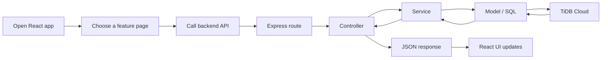
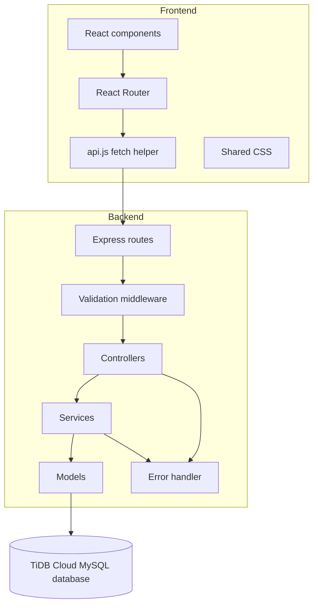

# Tournament Registration & Leaderboard System


A full-stack tournament management system with a React/Vite frontend, an Express backend, and a TiDB Cloud MySQL-compatible database.

## Overview

This application lets you manage players, tournaments, registrations, scores, leaderboards, and individual player ranks. The frontend is built with React and Vite, and the backend follows an MVC-style structure with controllers, services, models, validation middleware, and a centralized error handler.

## Features

- Player create, update, list, and delete.
- Tournament create, update, list, and delete.
- Tournament registration with duplicate prevention.
- Available-player lookup for each tournament.
- Score submission and update behavior.
- Tournament leaderboard.
- Player rank lookup with score.
- Centralized frontend API wrapper.
- Responsive React UI.
- TiDB Cloud database integration.

## Workflow



## Architecture



## Tech Stack

| Layer | Technology |
|---|---|
| Frontend | React, Vite, JavaScript, CSS |
| Backend | Node.js, Express.js |
| Database | TiDB Cloud / MySQL |
| API Style | REST |
| Testing | Manual API validation with Postman |

## Folder Structure

```text
Tournament-System/
├─ backend/
│  ├─ package.json
│  └─ src/
│     ├─ app.js
│     ├─ server.js
│     ├─ config/
│     ├─ controllers/
│     ├─ middleware/
│     ├─ models/
│     ├─ routes/
│     ├─ services/
│     ├─ utils/
│     └─ validators/
├─ frontend/
│  ├─ package.json
│  ├─ index.html
│  ├─ vite.config.js
│  ├─ css/
│  │  └─ style.css
│  └─ src/
│     ├─ App.jsx
│     ├─ api.js
│     ├─ main.jsx
│     ├─ styles.css
│     └─ pages/
│        ├─ DashboardPage.jsx
│        ├─ LeaderboardPage.jsx
│        ├─ PlayersPage.jsx
│        ├─ RegistrationPage.jsx
│        ├─ ScoresPage.jsx
│        └─ TournamentsPage.jsx
├─ docs/
│  └─ screenshots/
└─ README.md
```

## Database Schema

### Tables

- `players`
- `tournaments`
- `registrations`
- `scores`

### SQL Migration

```sql
CREATE DATABASE tournament_system;
USE tournament_system;

CREATE TABLE IF NOT EXISTS players (
  id INT AUTO_INCREMENT PRIMARY KEY,
  name VARCHAR(100) NOT NULL,
  email VARCHAR(100) UNIQUE NOT NULL,
  country VARCHAR(100) NOT NULL,
  created_at TIMESTAMP DEFAULT CURRENT_TIMESTAMP
);

CREATE TABLE IF NOT EXISTS tournaments (
  id INT AUTO_INCREMENT PRIMARY KEY,
  name VARCHAR(100) NOT NULL,
  max_players INT NOT NULL CHECK (max_players > 0),
  created_at TIMESTAMP DEFAULT CURRENT_TIMESTAMP
);

CREATE TABLE IF NOT EXISTS registrations (
  id INT AUTO_INCREMENT PRIMARY KEY,
  tournament_id INT NOT NULL,
  player_id INT NOT NULL,
  registered_at TIMESTAMP DEFAULT CURRENT_TIMESTAMP,
  UNIQUE KEY unique_registration (tournament_id, player_id),
  FOREIGN KEY (tournament_id) REFERENCES tournaments(id) ON DELETE CASCADE,
  FOREIGN KEY (player_id) REFERENCES players(id) ON DELETE CASCADE
);

CREATE TABLE IF NOT EXISTS scores (
  id INT AUTO_INCREMENT PRIMARY KEY,
  tournament_id INT NOT NULL,
  player_id INT NOT NULL,
  score INT NOT NULL DEFAULT 0,
  created_at TIMESTAMP DEFAULT CURRENT_TIMESTAMP,
  updated_at TIMESTAMP DEFAULT CURRENT_TIMESTAMP ON UPDATE CURRENT_TIMESTAMP,
  UNIQUE KEY unique_score (tournament_id, player_id),
  FOREIGN KEY (tournament_id) REFERENCES tournaments(id) ON DELETE CASCADE,
  FOREIGN KEY (player_id) REFERENCES players(id) ON DELETE CASCADE
);
```

## API Endpoints

### Players

- `GET /api/players`
- `POST /api/players`
- `PUT /api/players/:id`
- `DELETE /api/players/:id`
- `GET /api/players/available/:id`

### Tournaments

- `GET /api/tournaments`
- `POST /api/tournaments`
- `PUT /api/tournaments/:id`
- `DELETE /api/tournaments/:id`
- `GET /api/tournaments/:id/registrations`
- `GET /api/tournaments/:id/leaderboard`
- `GET /api/tournaments/:id/player/:playerId`
- `POST /api/tournaments/:id/register`
- `POST /api/tournaments/:id/score`

## Setup

### Backend

```bash
cd backend
npm install
npm run dev
```

### Frontend

```bash
cd frontend
npm install
npm run dev
```

### Production Preview

```bash
cd frontend
npm run build
npm run preview
```

## Environment Variables

Backend `.env` example:

```env
PORT=5000
DB_HOST=your-host
DB_PORT=4000
DB_USER=your-user
DB_PASSWORD=your-password
DB_NAME=tournament_system
DB_SSL=true
DB_CONNECT_TIMEOUT=30000
CORS_ORIGINS=http://localhost:5173,http://127.0.0.1:5173
```

## Screenshots

Store screenshots in `docs/screenshots/`.

- `docs/screenshots/dashboard.png`
- `docs/screenshots/players.png`
- `docs/screenshots/tournaments.png`
- `docs/screenshots/registration.png`
- `docs/screenshots/scores.png`
- `docs/screenshots/leaderboard.png`

## Testing with Postman

Postman was used to validate the REST API and endpoint behavior manually before the frontend was tested.

Recommended sequence:

1. Create a player.
2. Create a tournament.
3. Register the player.
4. Check available players.
5. Submit a score.
6. Fetch the leaderboard.
7. Fetch the player rank endpoint.

## Notes

- The frontend is now a React/Vite app, not a static HTML app.
- The repository keeps the backend and frontend separated for easier maintenance.
- The backend still serves the same REST API, so the React UI uses the same business logic.

## License

ISC
