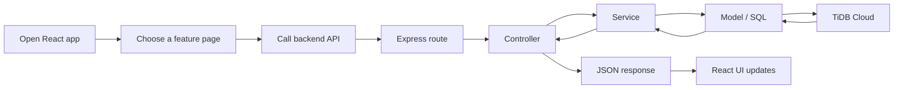
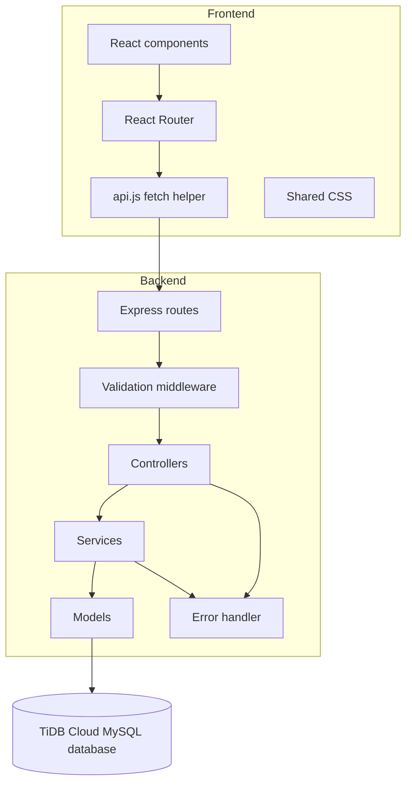
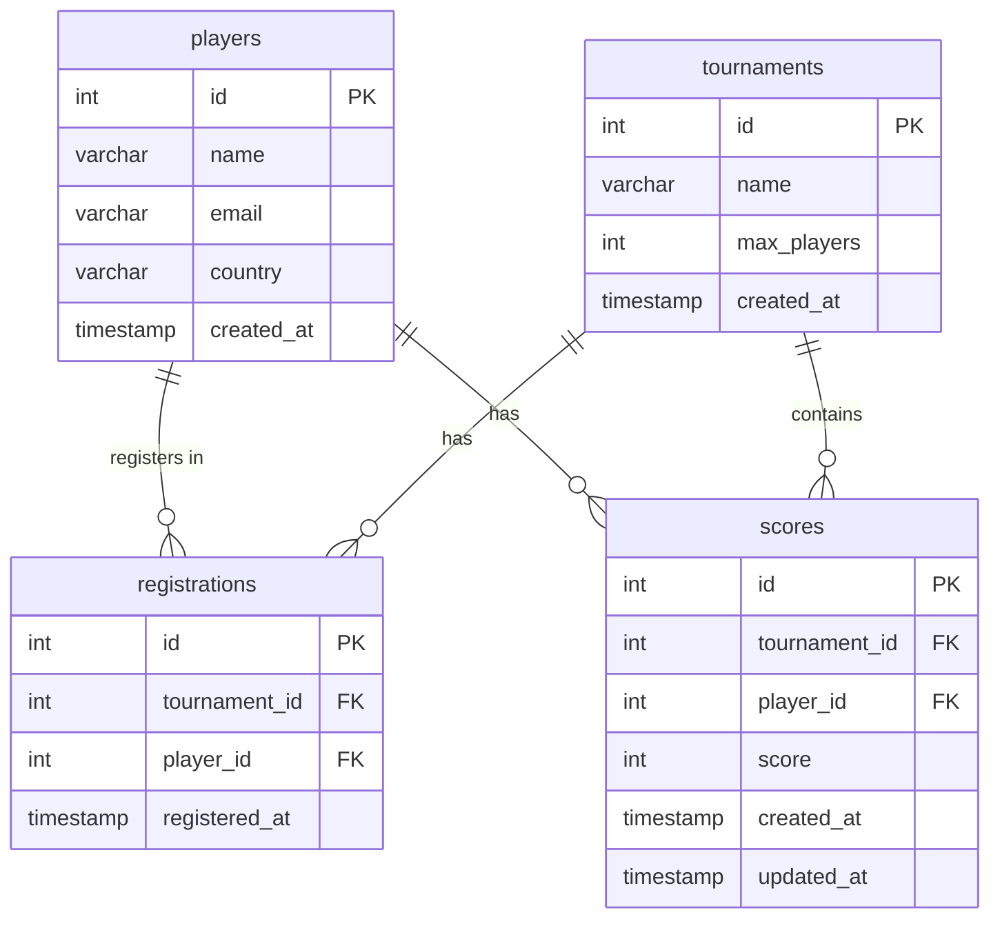
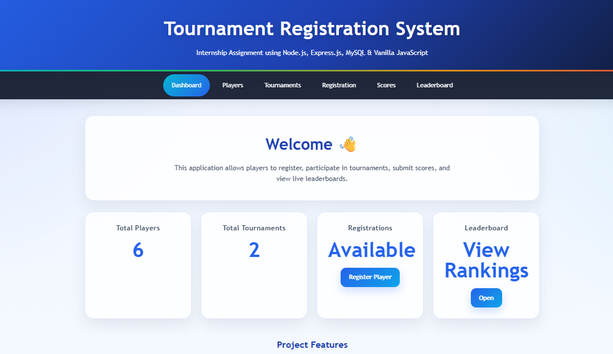
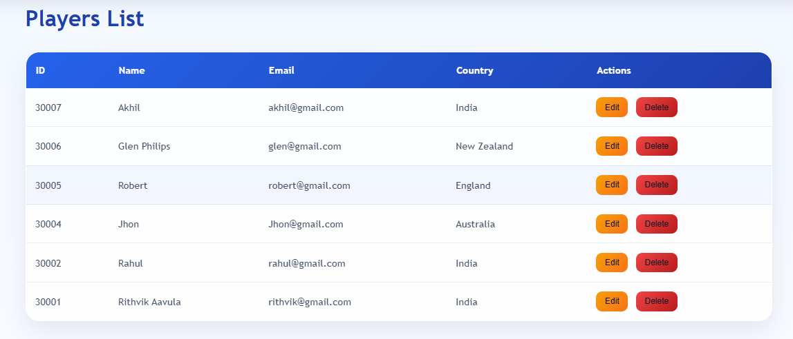
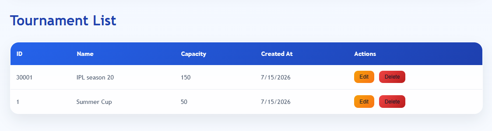
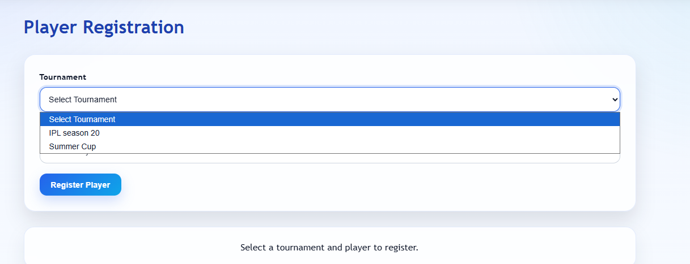
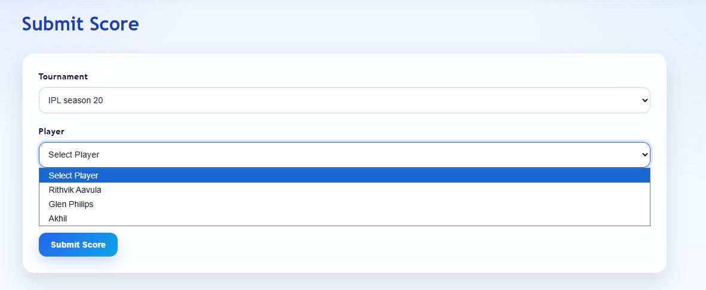
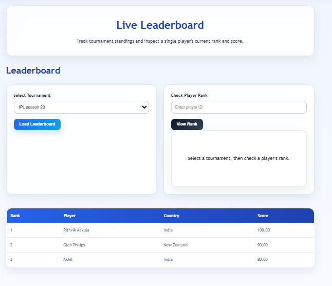

# 🏆 Tournament Registration & Leaderboard System

<div align="center">


**A production-quality full-stack tournament management system built as a Node.js Internship Assignment.**

[📖 Overview](#-overview) • [✨ Features](#-features) • [🚀 Quick Start](#-installation-guide) • [📡 API Docs](#-api-endpoints) • [🖼️ Screenshots](#️-screenshots)

</div>

---

## 📖 Overview

This application provides a complete tournament lifecycle — from player registration to live leaderboards. The **React + Vite** frontend communicates with an **Express.js** backend that follows a strict **MVC + Service Layer** architecture, backed by a **TiDB Cloud MySQL-compatible** database.

> Built to demonstrate real-world backend engineering: clean architecture, input validation, centralized error handling, and a fully abstracted REST API.

---

## ✨ Features

| # | Feature | Description |
|---|---------|-------------|
| 1 | 👤 **Player Management** | Create, update, list, and delete players |
| 2 | 🏟️ **Tournament Management** | Create, update, list, and delete tournaments |
| 3 | 📋 **Registration System** | Register players with duplicate prevention |
| 4 | 🔍 **Available Player Lookup** | Find unregistered players per tournament |
| 5 | 🎯 **Score Submission** | Submit scores with upsert (no duplicates) |
| 6 | 🏅 **Live Leaderboard** | Ranked leaderboard per tournament |
| 7 | 📊 **Player Rank Lookup** | Individual player rank and score per tournament |
| 8 | 🌐 **Frontend API Wrapper** | Centralized `api.js` fetch abstraction |
| 9 | 📱 **Responsive React UI** | Mobile-friendly interface with shared CSS |
| 10 | ☁️ **TiDB Cloud Integration** | SSL-secured cloud MySQL database |

---

## 🔄 System Workflow



---

## 🏗️ System Architecture



---

## 📁 Folder Structure

```text
Tournament-System/
├─ backend/
│  ├─ package.json
│  └─ src/
│     ├─ app.js                  ← Express app setup
│     ├─ server.js               ← Entry point
│     ├─ config/
│     │  └─ db.js                ← TiDB Cloud connection
│     ├─ controllers/            ← Request / response handlers
│     │  ├─ authController.js
│     │  ├─ leaderboardController.js
│     │  ├─ playerController.js
│     │  ├─ registrationController.js
│     │  ├─ scoreController.js
│     │  └─ tournamentController.js
│     ├─ exceptions/
│     │  └─ AppError.js          ← Custom error class
│     ├─ middleware/
│     │  ├─ errorHandler.js      ← Centralized error handler
│     │  └─ validator.js         ← Request validation middleware
│     ├─ models/                 ← Raw SQL query functions
│     │  ├─ playerModel.js
│     │  ├─ registrationModel.js
│     │  ├─ scoreModel.js
│     │  └─ tournamentModel.js
│     ├─ routes/                 ← Express route definitions
│     │  ├─ authRoutes.js
│     │  ├─ leaderboardRoutes.js
│     │  ├─ playerRoutes.js
│     │  ├─ registrationRoutes.js
│     │  ├─ scoreRoutes.js
│     │  └─ tournamentRoutes.js
│     ├─ services/               ← Business logic layer
│     │  ├─ authService.js
│     │  ├─ leaderboardService.js
│     │  ├─ playerService.js
│     │  ├─ registrationService.js
│     │  ├─ scoreService.js
│     │  └─ tournamentService.js
│     ├─ utils/
│     │  └─ response.js          ← Standardized JSON response helper
│     └─ validators/             ← Joi / express-validator schemas
│        ├─ authValidator.js
│        ├─ playerValidator.js
│        ├─ registrationValidator.js
│        ├─ scoreValidator.js
│        └─ tournamentValidator.js
├─ frontend/
│  ├─ package.json
│  ├─ index.html
│  ├─ vite.config.js
│  ├─ css/
│  │  └─ style.css               ← Global styles
│  └─ src/
│     ├─ App.jsx                 ← Root component + routing
│     ├─ api.js                  ← Centralized fetch wrapper
│     ├─ main.jsx                ← React entry point
│     ├─ styles.css
│     └─ pages/
│        ├─ DashboardPage.jsx
│        ├─ LeaderboardPage.jsx
│        ├─ PlayersPage.jsx
│        ├─ RegistrationPage.jsx
│        ├─ ScoresPage.jsx
│        └─ TournamentsPage.jsx
├─ docs/
│  └─ screenshots/               ← UI screenshots
└─ README.md
```

---

## 🛠️ Technology Stack

| Layer | Technology | Purpose |
|-------|-----------|---------|
| ⚛️ **Frontend** | React, Vite, JavaScript, CSS | UI rendering and routing |
| 🟢 **Runtime** | Node.js 18+ | JavaScript server runtime |
| 🚂 **Framework** | Express.js | HTTP server and routing |
| 🗄️ **Database** | TiDB Cloud / MySQL | Persistent data storage |
| 🔐 **Security** | SSL/TLS, CORS | Secure DB connection and origin control |
| 🧪 **Testing** | Postman | Manual REST API validation |
| 📦 **Package Manager** | npm | Dependency management |
| ⚙️ **Dev Tool** | nodemon | Auto-restart on file changes |

---

## 🗄️ Database Design

### Entity Relationship Overview



### Tables Summary

| Table | Primary Key | Unique Constraint | Foreign Keys |
|-------|------------|-------------------|--------------|
| `players` | `id` | `email` | — |
| `tournaments` | `id` | — | — |
| `registrations` | `id` | `(tournament_id, player_id)` | → players, → tournaments |
| `scores` | `id` | `(tournament_id, player_id)` | → players, → tournaments |

---

## 🧱 Database Schema

```sql
CREATE DATABASE tournament_system;
USE tournament_system;

CREATE TABLE IF NOT EXISTS players (
  id         INT AUTO_INCREMENT PRIMARY KEY,
  name       VARCHAR(100) NOT NULL,
  email      VARCHAR(100) UNIQUE NOT NULL,
  country    VARCHAR(100) NOT NULL,
  created_at TIMESTAMP DEFAULT CURRENT_TIMESTAMP
);

CREATE TABLE IF NOT EXISTS tournaments (
  id         INT AUTO_INCREMENT PRIMARY KEY,
  name       VARCHAR(100) NOT NULL,
  max_players INT NOT NULL CHECK (max_players > 0),
  created_at TIMESTAMP DEFAULT CURRENT_TIMESTAMP
);

CREATE TABLE IF NOT EXISTS registrations (
  id            INT AUTO_INCREMENT PRIMARY KEY,
  tournament_id INT NOT NULL,
  player_id     INT NOT NULL,
  registered_at TIMESTAMP DEFAULT CURRENT_TIMESTAMP,
  UNIQUE KEY unique_registration (tournament_id, player_id),
  FOREIGN KEY (tournament_id) REFERENCES tournaments(id) ON DELETE CASCADE,
  FOREIGN KEY (player_id)     REFERENCES players(id)     ON DELETE CASCADE
);

CREATE TABLE IF NOT EXISTS scores (
  id            INT AUTO_INCREMENT PRIMARY KEY,
  tournament_id INT NOT NULL,
  player_id     INT NOT NULL,
  score         INT NOT NULL DEFAULT 0,
  created_at    TIMESTAMP DEFAULT CURRENT_TIMESTAMP,
  updated_at    TIMESTAMP DEFAULT CURRENT_TIMESTAMP ON UPDATE CURRENT_TIMESTAMP,
  UNIQUE KEY unique_score (tournament_id, player_id),
  FOREIGN KEY (tournament_id) REFERENCES tournaments(id) ON DELETE CASCADE,
  FOREIGN KEY (player_id)     REFERENCES players(id)     ON DELETE CASCADE
);
```

---

## 📡 API Endpoints

### 👤 Players

| Method | Endpoint | Description |
|--------|----------|-------------|
| `GET` | `/api/players` | List all players |
| `POST` | `/api/players` | Create a new player |
| `PUT` | `/api/players/:id` | Update a player |
| `DELETE` | `/api/players/:id` | Delete a player |
| `GET` | `/api/players/available/:id` | Players not yet in tournament `id` |

### 🏟️ Tournaments

| Method | Endpoint | Description |
|--------|----------|-------------|
| `GET` | `/api/tournaments` | List all tournaments |
| `POST` | `/api/tournaments` | Create a new tournament |
| `PUT` | `/api/tournaments/:id` | Update a tournament |
| `DELETE` | `/api/tournaments/:id` | Delete a tournament |
| `GET` | `/api/tournaments/:id/registrations` | All registrations for a tournament |
| `GET` | `/api/tournaments/:id/leaderboard` | Ranked leaderboard |
| `GET` | `/api/tournaments/:id/player/:playerId` | Player rank and score |
| `POST` | `/api/tournaments/:id/register` | Register a player |
| `POST` | `/api/tournaments/:id/score` | Submit or update a score |

---

## 🚀 Installation Guide

### Prerequisites

| Requirement | Version |
|-------------|---------|
| Node.js | 18+ |
| npm | 9+ |
| TiDB Cloud account | Free tier works |

### Clone the Repository

```bash
git clone https://github.com/<your-username>/tournament-system.git
cd tournament-system/Tournament-System
```

---

## ☁️ TiDB Cloud Database Setup

1. Go to [tidbcloud.com](https://tidbcloud.com) and create a free **Serverless** cluster.
2. Open the **Connect** dialog → choose **General** → copy the connection string details.
3. In the SQL editor, run the full schema from the [Database Schema](#-database-schema) section above.
4. Enable **SSL** — TiDB Cloud requires it for all connections.
5. Paste the credentials into your `.env` file (see below).

---

## 🔐 Environment Variables

Create `backend/.env`:

```env
PORT=5000
DB_HOST=your-tidb-host.tidbcloud.com
DB_PORT=4000
DB_USER=your-user
DB_PASSWORD=your-password
DB_NAME=tournament_system
DB_SSL=true
DB_CONNECT_TIMEOUT=30000
CORS_ORIGINS=http://localhost:5173,http://127.0.0.1:5173
```

> ⚠️ Never commit `.env` to version control. It is already listed in `.gitignore`.

---

## ▶️ Running the Backend

```bash
cd backend
npm install
npm run dev
```

Server starts at `http://localhost:5000`.

---

## 🖥️ Running the Frontend

```bash
cd frontend
npm install
npm run dev
```

App opens at `http://localhost:5173`.

### Production Build

```bash
cd frontend
npm run build
npm run preview
```

---

## 🖼️ Screenshots

| Page | Preview |
|------|---------|
| 🏠 Dashboard |  |
| 👤 Players |  |
| 🏟️ Tournaments |  |
| 📋 Registration |  |
| 🎯 Scores |  |
| 🏅 Leaderboard |  |

---

## 🧪 Testing with Postman

Postman was used to validate all REST API endpoints and behavior before the frontend was connected.

### Recommended Test Sequence

| Step | Action | Endpoint |
|------|--------|----------|
| 1 | Create a player | `POST /api/players` |
| 2 | Create a tournament | `POST /api/tournaments` |
| 3 | Register the player | `POST /api/tournaments/:id/register` |
| 4 | Check available players | `GET /api/players/available/:id` |
| 5 | Submit a score | `POST /api/tournaments/:id/score` |
| 6 | Fetch the leaderboard | `GET /api/tournaments/:id/leaderboard` |
| 7 | Fetch player rank | `GET /api/tournaments/:id/player/:playerId` |

---

## 🧩 Problems Faced During Development

### 1 — TiDB CHECK Constraint Issue

| | |
|---|---|
| **Problem** | `CHECK (max_players > 0)` caused a syntax error on older TiDB versions |
| **Root Cause** | Some TiDB Serverless tiers silently ignore or reject `CHECK` constraints |
| **Solution** | Moved the validation into the service layer instead of relying on the DB constraint |
| **Outcome** | Validation is now consistent regardless of the database engine version |
| **Lesson** | Never rely solely on DB-level constraints — always validate in the application layer |

---

### 2 — TiDB Cloud Connection Setup

| | |
|---|---|
| **Problem** | Initial connection attempts to TiDB Cloud timed out or were refused |
| **Root Cause** | Missing SSL configuration and incorrect port (`3306` instead of `4000`) |
| **Solution** | Set `DB_PORT=4000`, enabled `ssl: { rejectUnauthorized: true }` in `db.js` |
| **Outcome** | Stable, SSL-secured connection established |
| **Lesson** | Cloud databases have non-standard ports and mandatory SSL — always read the provider docs |

---

### 3 — MySQL SSL Configuration

| | |
|---|---|
| **Problem** | Node.js `mysql2` threw `UNABLE_TO_VERIFY_LEAF_SIGNATURE` errors |
| **Root Cause** | TiDB Cloud uses a certificate chain that Node.js couldn't verify by default |
| **Solution** | Used `ssl: { minVersion: 'TLSv1.2', rejectUnauthorized: true }` with the TiDB CA bundle |
| **Outcome** | Encrypted connection verified and stable |
| **Lesson** | Always pin the CA certificate for cloud database SSL connections in production |

---

### 4 — Duplicate Registration Prevention

| | |
|---|---|
| **Problem** | The same player could be registered to the same tournament multiple times |
| **Root Cause** | No uniqueness check existed at the application or database level initially |
| **Solution** | Added `UNIQUE KEY unique_registration (tournament_id, player_id)` and a service-layer pre-check |
| **Outcome** | Duplicate registrations return a clear `409 Conflict` error |
| **Lesson** | Enforce uniqueness at both the DB and service layer for defense in depth |

---

### 5 — Dynamic Player Loading in Registration

| | |
|---|---|
| **Problem** | The registration dropdown showed all players, including already-registered ones |
| **Root Cause** | The frontend was fetching all players without filtering by tournament |
| **Solution** | Built `GET /api/players/available/:id` which excludes already-registered players via a `NOT IN` subquery |
| **Outcome** | Dropdown only shows eligible players |
| **Lesson** | Filtering at the database level is far more efficient than filtering in the frontend |

---

### 6 — Score Update Instead of Duplicate Insertion

| | |
|---|---|
| **Problem** | Submitting a score twice created a duplicate row and threw a unique key error |
| **Root Cause** | The score endpoint used a plain `INSERT` with no conflict handling |
| **Solution** | Replaced with `INSERT ... ON DUPLICATE KEY UPDATE score = VALUES(score)` |
| **Outcome** | Score submission is idempotent — re-submitting updates the existing record |
| **Lesson** | Use upsert patterns (`ON DUPLICATE KEY UPDATE`) for data that should be overwritten, not duplicated |

---

### 7 — MVC Architecture Decisions

| | |
|---|---|
| **Problem** | Early code mixed SQL queries, business logic, and HTTP response handling in one file |
| **Root Cause** | No architectural pattern was enforced at the start |
| **Solution** | Refactored into strict MVC: routes → controllers → services → models |
| **Outcome** | Each layer has a single responsibility; code is easy to test and extend |
| **Lesson** | Establish architecture before writing business logic, not after |

---

### 8 — Service Layer Implementation

| | |
|---|---|
| **Problem** | Controllers were becoming bloated with business rules |
| **Root Cause** | No separation between HTTP handling and domain logic |
| **Solution** | Introduced a dedicated `services/` layer that owns all business logic |
| **Outcome** | Controllers are thin; services are reusable and independently testable |
| **Lesson** | The service layer is the most important layer in a scalable backend |

---

### 9 — Validation Strategy

| | |
|---|---|
| **Problem** | Invalid payloads (missing fields, wrong types) reached the database and caused cryptic errors |
| **Root Cause** | No input validation existed at the route level |
| **Solution** | Added `validators/` schemas and a `validator.js` middleware that runs before controllers |
| **Outcome** | Invalid requests are rejected at the edge with descriptive `400 Bad Request` messages |
| **Lesson** | Validate at the boundary — never let bad data reach your business logic |

---

### 10 — REST API Design

| | |
|---|---|
| **Problem** | Early endpoints used inconsistent naming and HTTP methods |
| **Root Cause** | No REST conventions were defined upfront |
| **Solution** | Adopted standard REST: nouns for resources, correct HTTP verbs, nested routes for relationships |
| **Outcome** | Predictable, self-documenting API that follows industry conventions |
| **Lesson** | REST is a contract — define it before you build it |

---

### 11 — Error Handling Strategy

| | |
|---|---|
| **Problem** | Unhandled errors crashed the server or returned raw stack traces to the client |
| **Root Cause** | No centralized error handling middleware |
| **Solution** | Created `AppError.js` (custom error class) and `errorHandler.js` (Express error middleware) |
| **Outcome** | All errors are caught, logged, and returned as structured JSON with appropriate HTTP status codes |
| **Lesson** | Centralized error handling is non-negotiable in production APIs |

---

### 12 — Frontend API Abstraction (`api.js`)

| | |
|---|---|
| **Problem** | Every React component had its own `fetch()` calls with repeated base URL and headers |
| **Root Cause** | No shared HTTP client existed on the frontend |
| **Solution** | Created `api.js` — a single module that wraps all fetch calls with the base URL, headers, and error handling |
| **Outcome** | Components call clean functions like `api.getPlayers()` instead of raw fetch |
| **Lesson** | Abstract your HTTP layer — it makes refactoring and error handling dramatically easier |

---

### 13 — Responsive UI Implementation

| | |
|---|---|
| **Problem** | The UI broke on smaller screens — tables overflowed, cards stacked poorly |
| **Root Cause** | Fixed pixel widths and no mobile breakpoints |
| **Solution** | Used CSS Grid with `auto-fit / minmax`, `clamp()` for font sizes, and `overflow-x: auto` on tables |
| **Outcome** | Fully responsive layout that works on mobile, tablet, and desktop |
| **Lesson** | Design mobile-first — retrofitting responsiveness is always harder than building it in |

---

## 🎓 Challenges & Learning Outcomes

| Challenge | What Was Learned |
|-----------|-----------------|
| Cloud DB SSL setup | How to configure TLS for production database connections |
| MVC refactoring | How to separate concerns cleanly in a Node.js backend |
| Upsert patterns | When to use `ON DUPLICATE KEY UPDATE` vs separate update logic |
| Centralized error handling | How Express error middleware works and why it matters |
| Frontend API abstraction | How to build a clean HTTP client layer in React |
| REST API design | Resource naming, HTTP verbs, status codes, and nested routes |
| Input validation | How to validate at the boundary before data reaches business logic |

---

## ✅ Best Practices Followed

- 🔒 **Environment variables** for all secrets — never hardcoded
- 🏗️ **MVC + Service Layer** — strict separation of concerns
- 🛡️ **Input validation** at the route boundary before controllers
- ⚠️ **Centralized error handling** with custom `AppError` class
- 🔁 **Upsert pattern** for score submission
- 🚫 **Duplicate prevention** at both DB and service layer
- 📦 **Modular routing** — one file per resource
- 🌐 **CORS configuration** via environment variable
- 📱 **Responsive CSS** with Grid and `clamp()`
- 🧹 **Clean code** — no business logic in controllers, no SQL in services

---

## 🔮 Future Improvements

| Improvement | Description |
|-------------|-------------|
| 🔐 JWT Authentication | Protect admin routes with token-based auth |
| 📄 Pagination | Add limit/offset to list endpoints |
| 🔍 Search & Filter | Filter players and tournaments by name/country |
| 📊 Analytics Dashboard | Charts for score trends and tournament stats |
| 🧪 Automated Testing | Jest unit tests for services and integration tests for routes |
| 🐳 Docker | Containerize backend and frontend for easy deployment |
| 🚀 CI/CD Pipeline | GitHub Actions for automated test and deploy |
| 📬 Email Notifications | Notify players on registration and score updates |

---

## 🚢 Deployment Guide

### Backend (Railway / Render)

```bash
# Set all environment variables in the platform dashboard
# Deploy from GitHub — platform auto-runs:
npm install
npm start
```

### Frontend (Vercel / Netlify)

```bash
# Set VITE_API_URL environment variable to your deployed backend URL
npm run build
# Deploy the dist/ folder
```

> Update `CORS_ORIGINS` in the backend `.env` to include your deployed frontend URL.

---

## 📂 GitHub Repository Instructions

```bash
# Initialize
git init
git add .
git commit -m "feat: initial commit — Tournament Registration & Leaderboard System"

# Push
git remote add origin https://github.com/<your-username>/tournament-system.git
git branch -M main
git push -u origin main
```

> Make sure `.env` is in `.gitignore` before the first commit.

---

## 🤝 Contributing

Contributions are welcome!

1. Fork the repository
2. Create a feature branch: `git checkout -b feat/your-feature`
3. Commit your changes: `git commit -m "feat: add your feature"`
4. Push to the branch: `git push origin feat/your-feature`
5. Open a Pull Request

---

## 📝 Notes

- The frontend is a React/Vite app — not a static HTML app.
- The backend and frontend are kept in separate folders for independent deployment.
- The backend serves the same REST API regardless of which frontend consumes it.

---

## 📄 License

This project is licensed under the **ISC License**.

---

## 👤 Author

Built as a **Node.js Internship Assignment** — demonstrating full-stack engineering with clean architecture, cloud database integration, and a production-quality REST API.

---

<div align="center">

⭐ If you found this project useful, please give it a star!

</div>
